# Olist Marketplace Analytics: From Raw Data to Retention Strategy

End-to-end analytics case study on the **Olist Brazilian e-commerce** dataset
(~100k orders, 2016 to 2018). I take raw, messy, multi-table data all the way to an
interactive dashboard and a set of business recommendations, covering the full
workflow of a data analyst.

**Skills demonstrated:** SQL (DuckDB) · data cleaning & modeling · RFM segmentation ·
cohort retention · A/B / hypothesis testing · Python EDA (pandas, plotly) ·
interactive BI dashboards (**Tableau** & **Power BI**) · **star-schema data modeling** ·
**DAX** · data storytelling.

📊 **Live dashboard:** **[View on Tableau Public](https://public.tableau.com/app/profile/wassim.mabrouk/viz/OlistMarketplaceAnalytics_17878955790140/OlistMarketplaceAnalytics)**
📄 **Executive summary:** [`reports/executive_summary.pdf`](reports/executive_summary.pdf)

<p align="center">
  <a href="https://public.tableau.com/app/profile/wassim.mabrouk/viz/OlistMarketplaceAnalytics_17878955790140/OlistMarketplaceAnalytics">
    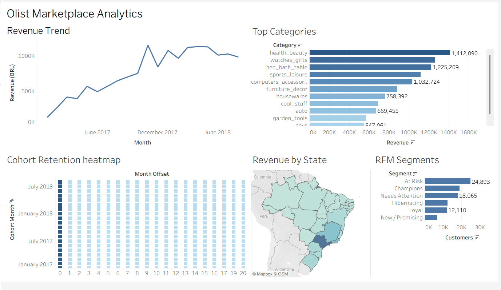
  </a>
</p>

---

## The business question

You're the analyst at an online marketplace. Leadership wants to know:

1. **Where does revenue come from?** Which categories, regions, and months drive it?
2. **Who are our best customers**, and how many are we losing after one purchase?
3. **Does delivery speed or review score affect whether a customer buys again?**
4. **What should we do about it?**

## Headline findings

Analysis run on **110,197 delivered order-items** / **93,358 customers**.

1. **The marketplace barely retains anyone.** Only **3.0%** of customers ever place a
   second order (2,801 repeat vs 90,557 one-time). Cohort retention collapses to
   near-zero the month after acquisition. This is an acquisition-heavy, retention-weak
   business, and retention is the single biggest lever.
2. **Faster delivery means happier customers.** Orders delivered in ≤10 days (the
   median) average **4.38★** vs **3.93★** for slower ones, and their 5-star rate is
   **66.6%** vs **51.5%**, a **+15-point** gap. The difference is statistically
   unambiguous (Welch t = 55.4, p ≪ 0.001; two-proportion z = 47.5) with a
   *small-to-moderate* effect size (Cohen's d = 0.36).
3. **Because satisfied customers are the ones who come back, cutting delivery time is
   a concrete, evidence-backed way to attack the 97% one-time-buyer problem.**

<p align="center">
  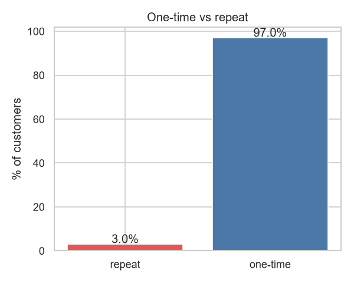
  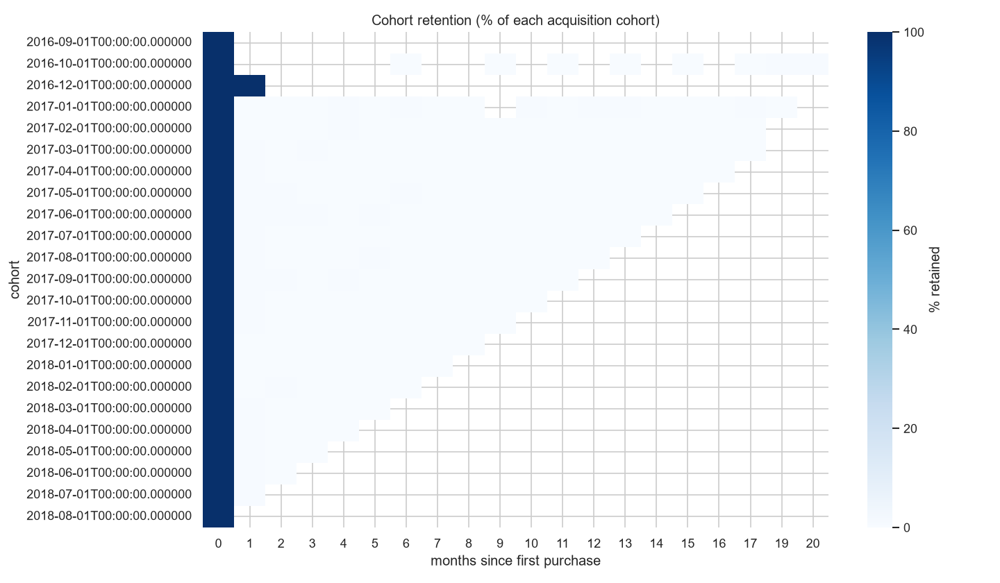
</p>

### A/B test detail: delivery speed vs. review score

| Group (delivery) | Orders | Mean score | 5-star rate |
|------------------|-------:|-----------:|------------:|
| Fast (≤10 days)  | 49,622 | 4.38       | 66.6%       |
| Slow (>10 days)  | 45,919 | 3.93       | 51.5%       |

Welch t-test: t = 55.4, p ≪ 0.001 · Cohen's d = 0.36 · two-proportion z-test: z = 47.5, p ≪ 0.001.

> **Reading it honestly:** with ~95k orders, almost any real difference reaches
> significance, so the effect *size* (d ≈ 0.36, a ~0.46-point lift on a 5-point scale)
> is what matters. The signal is real and worth acting on, but moderate, not dramatic.

<p align="center">
  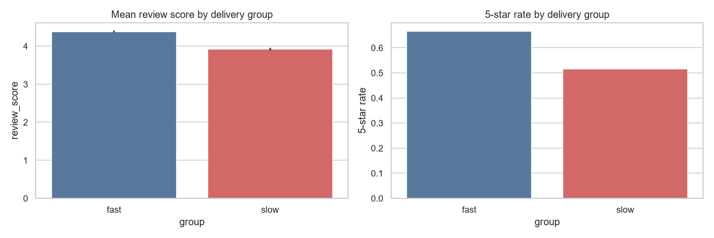
</p>

## Data

**Source:** [Brazilian E-Commerce Public Dataset by Olist](https://www.kaggle.com/datasets/olistbr/brazilian-ecommerce) (Kaggle).
Download and unzip into `data/raw/`, following [`data/README.md`](data/README.md).
Raw CSVs are **not** committed (see `.gitignore`); the pipeline rebuilds everything.

## Tech stack

| Layer            | Tool                                  |
|------------------|---------------------------------------|
| Storage / SQL    | DuckDB (in-repo, no server needed)    |
| Analysis         | SQL + Python (pandas, scipy)          |
| Visualization    | Plotly / Matplotlib (EDA), Tableau (dashboard) |
| Modeling / BI    | Power BI Desktop (star schema, DAX, Power Query) |
| Reproducibility  | `requirements.txt`, scripted build    |

## Repo structure

```
retail-analytics/
├── sql/                 SQL analysis, run in order
│   ├── 00_load.sql          load raw CSVs into DuckDB tables
│   ├── 01_cleaning.sql      clean, delivered-orders fact view
│   ├── 02_kpis.sql          revenue / AOV / category / geography
│   ├── 03_rfm.sql           RFM customer segmentation
│   └── 04_cohort_retention.sql   monthly cohort retention
├── src/build_db.py      build the DuckDB from raw CSVs
├── notebooks/           EDA + A/B test
├── dashboard/           Tableau dashboard image + chart screenshots
├── powerbi/             Power BI rebuild (.pbix, star-schema export, screenshots)
├── reports/             executive summary (PDF)
├── data/                raw CSVs (git-ignored) + how to get them
└── requirements.txt
```

## How to run

```bash
pip install -r requirements.txt
# 1. Put the Olist CSVs in data/raw/ (see data/README.md)
python src/build_db.py            # builds data/olist.duckdb + the clean fact view
# 2. Run the analysis notebooks (writes extracts to data/processed/ + charts to dashboard/screenshots/)
jupyter notebook                  # run notebooks/01_eda.ipynb then notebooks/02_ab_test.ipynb
# 3. Or explore any query directly:
duckdb data/olist.duckdb ".read sql/03_rfm.sql"
```

## Methodology notes

- **Customer identity:** Olist's `customer_id` is unique *per order*. The real
  cross-order identity is `customer_unique_id`, which RFM and cohort analysis rely on;
  otherwise every customer looks like a one-time buyer. (A common trap with this dataset.)
- **RFM interpretation:** because 97% of customers buy only once, the **Frequency**
  dimension barely varies, so the segments are effectively driven by Recency and
  Monetary value. "Champions" here are high-recency, high-spend *first-time* buyers, not
  proven repeat loyalists. That is a direct consequence of the retention finding, not a bug.
- **Scope:** analysis is on `delivered` orders with a positive item price, so revenue
  reflects completed sales.
- **Cohort scope:** cohort analysis is limited to Jan 2017 onward. The 2016 cohorts
  are excluded because the marketplace was barely active then (some months had ~1
  customer), which makes their retention percentages noise rather than signal. Recent
  cohorts naturally have fewer observed months, so the triangular shape of the heatmap is
  expected, not missing data.
- **Revenue** = item `price` + `freight_value`.

## Selected visuals

<p align="center">
  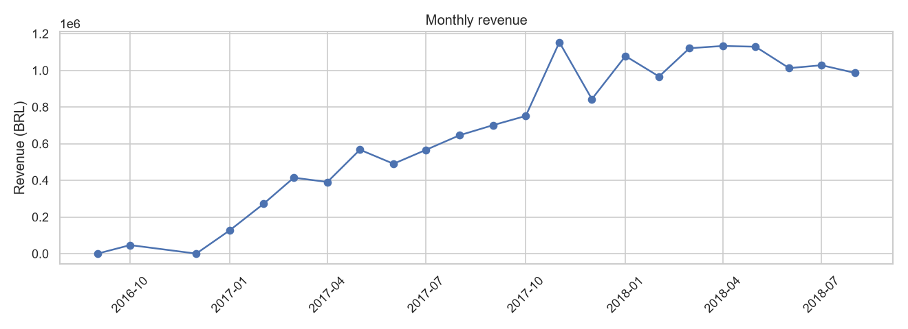
  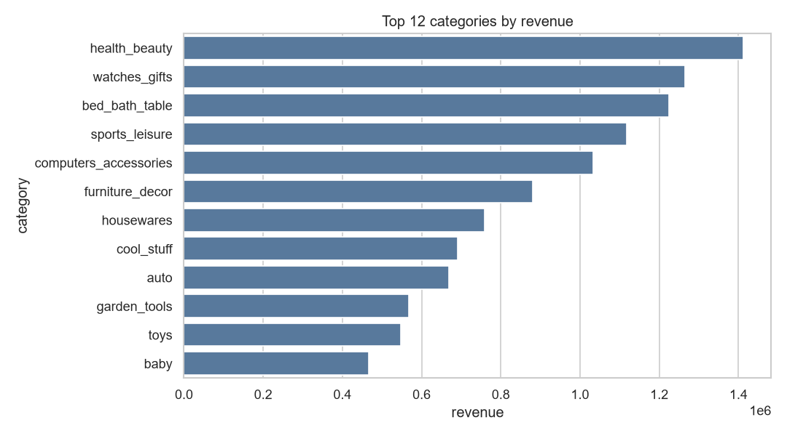
</p>
<p align="center">
  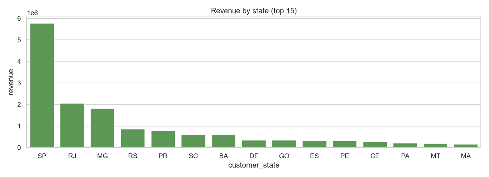
  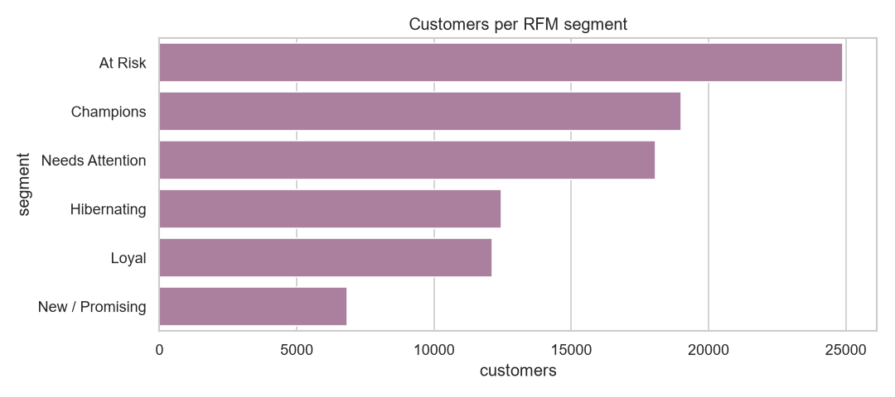
</p>
<p align="center">
  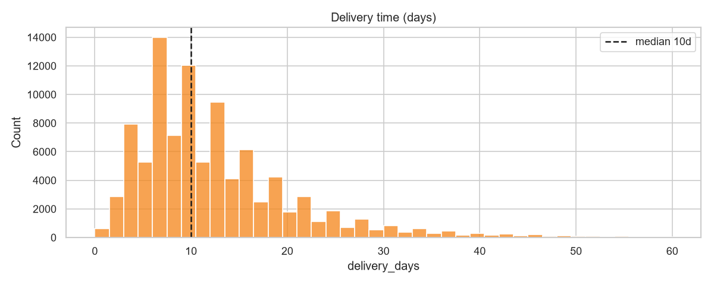
</p>

## Power BI rebuild: the modeling layer

The same five views, rebuilt in **Power BI Desktop** on a proper **star schema**. Where the Tableau build focuses on storytelling from flat extracts, this version demonstrates the modeling that BI roles actually ask for: a dimensional model, a dedicated date table, and metrics computed live in **DAX** rather than pre-baked. It exercises Power BI, DAX, Power Query (M), star-schema data modeling (Datenmodellierung), time intelligence, RFM, and cohort analysis.

📥 **Open it:** [`powerbi/retail-analytics.pbix`](powerbi/retail-analytics.pbix) (Power BI Desktop, free)

**What it shows beyond the Tableau version:**

- **Star schema.** A single `fct_order_items` fact surrounded by `dim_date`, `dim_customer`, `dim_product`, and `dim_geography`, with single-direction relationships. The fact is derived from the same DuckDB pipeline, so every figure matches the Tableau dashboard.
- **Date table + time intelligence.** `dim_date` is marked as the model's date table, enabling DAX time-intelligence measures (`Revenue MoM %`, `Revenue YoY %`).
- **RFM computed live in DAX.** Recency, Frequency, and Monetary plus the quintile scores are calculated columns on `dim_customer` (`RANKX`-based quintiles), so the segmentation is part of the model, not a precomputed CSV. Same honest caveat as above: with 97% one-time buyers, Frequency is degenerate, so segments are driven by Recency × Monetary.
- **Geocode-free map.** `dim_geography` carries state centroid lat/long, so the Revenue-by-State map plots reliably without depending on Bing's geocoding of Brazilian states.
- **Cohort heatmap.** The monthly retention matrix with a conditional-formatting colour scale, reproducing the Tableau cohort finding.

<p align="center">
  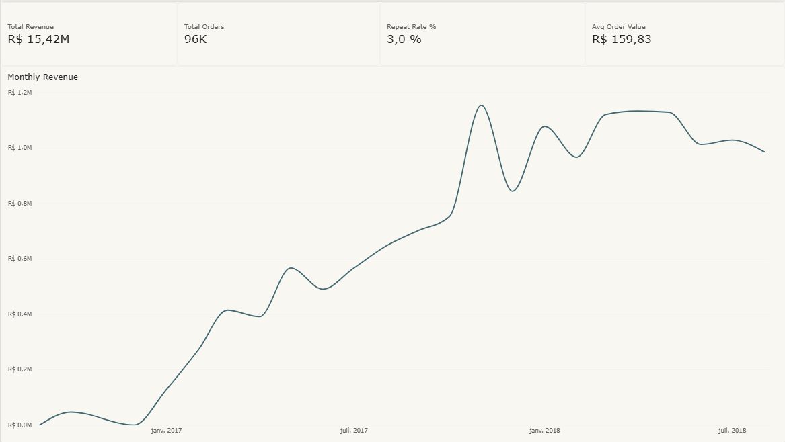
  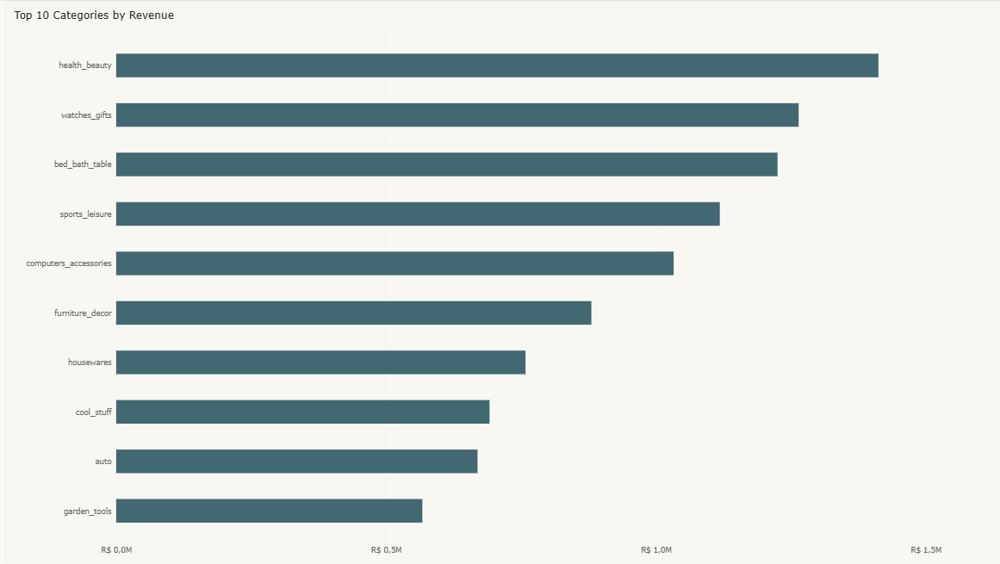
</p>
<p align="center">
  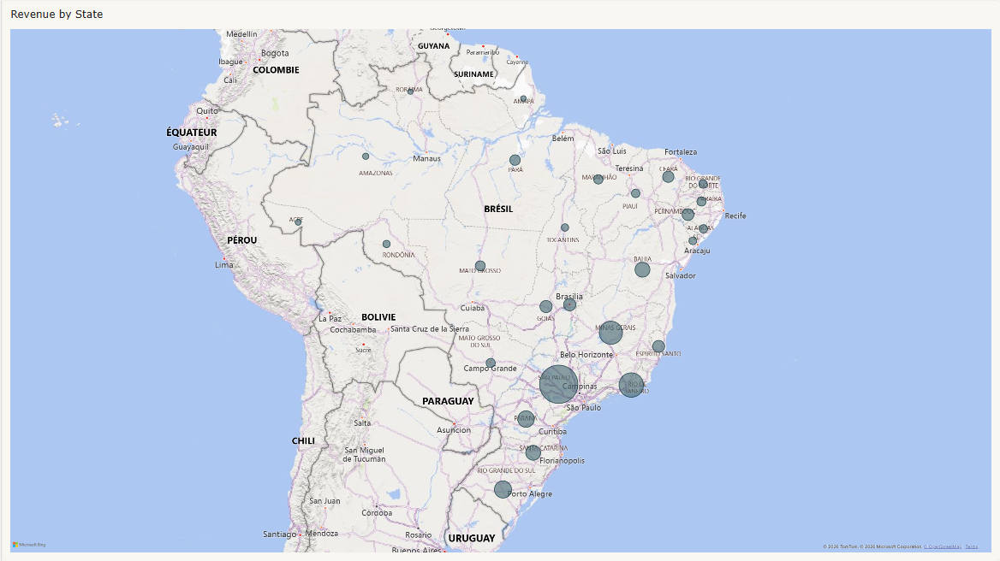
  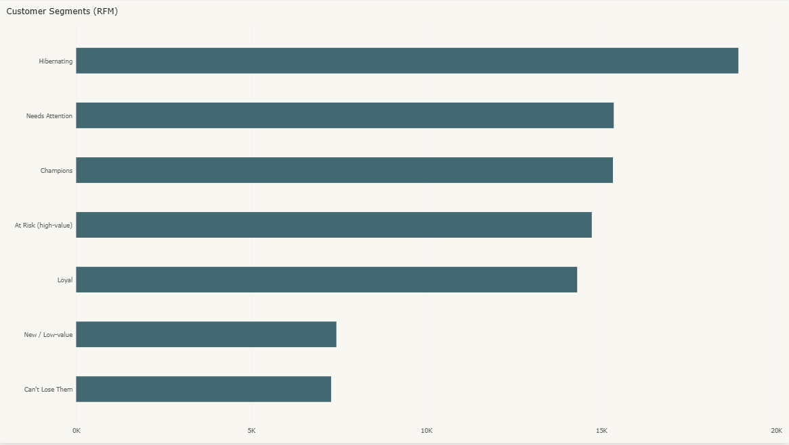
</p>
<p align="center">
  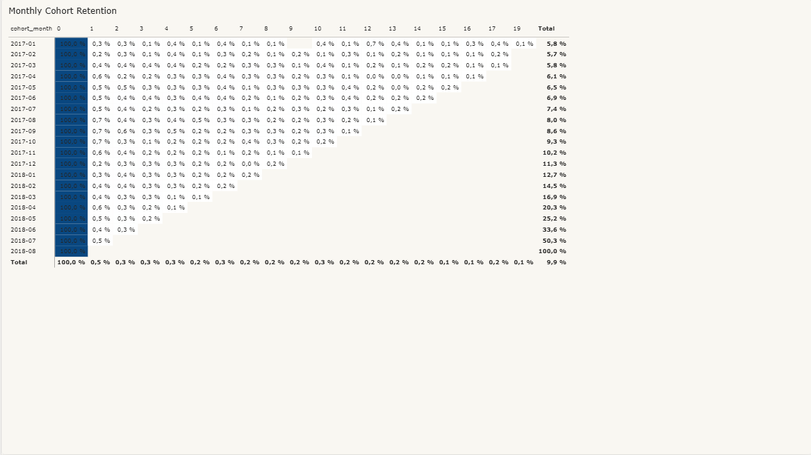
</p>

**Rebuild it yourself:** `powerbi/export_star_schema.py` reads `data/olist.duckdb` and writes the star-schema tables to `powerbi/data/`, which the `.pbix` imports.

```bash
py powerbi/export_star_schema.py
```

---

_Built by Wassim Mabrouk · [github.com/wassimomabrouk](https://github.com/wassimomabrouk)_
